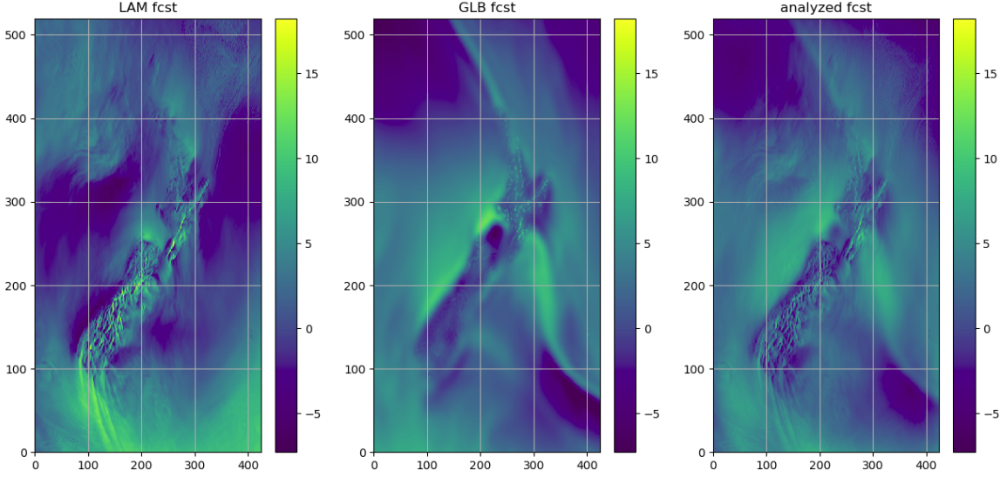

.. var_blending_docs documentation master file, created by
   sphinx-quickstart on Mon Dec 31 17:30:26 2018.
   You can adapt this file completely to your liking, but it should at least
   contain the root `toctree` directive.

Welcome to VAR_BLENDING documentation
=============================================

**VAR_BLENDING** package provides a Variational based method to blend different NWP models (e.g., a global model and a limited area model) on a spectral space.

* Release: 0.0.1

* Date: 2018-12-28

This package is developed by New Zealand Meteorological Service, and to work with Amazon Web Service Storage Server S3

Questions go to: sijin.zhang@metservice.com

.. topic:: There are a few assumptions of using this method:

    * a global model (e.g., GFS or ECMWF) is able to provide better large scale weather patterns than a limited area model (e.g., high resolution WRF)

    * the truth of atmosphere lies between the global model and limited area model

    * there are no correlations among the fields to be blended

    * a global model and a limited area model contains similar amount of energies for the large scale patterns (e.g., where the wavenumber is bigger than a certain value)

    * the imbalances among fields after the blending analysis can be solved by the model itself

About this software
^^^^^^^^^^^^^^^^^^^^
.. toctree::
  :maxdepth: 2

     license <license.rst>
     help <help.rst>

Methodology
^^^^^^^^^^^^^^^^^^
.. toctree::
  :maxdepth: 1

     mathematical ideas <methods.rst>

Sample workflow
^^^^^^^^^^^^^^^^^^
.. toctree::
   :maxdepth: 3

      Step 1: preparing model errors <step1.rst>
      Step 2: running Variational blending <step2.rst>
